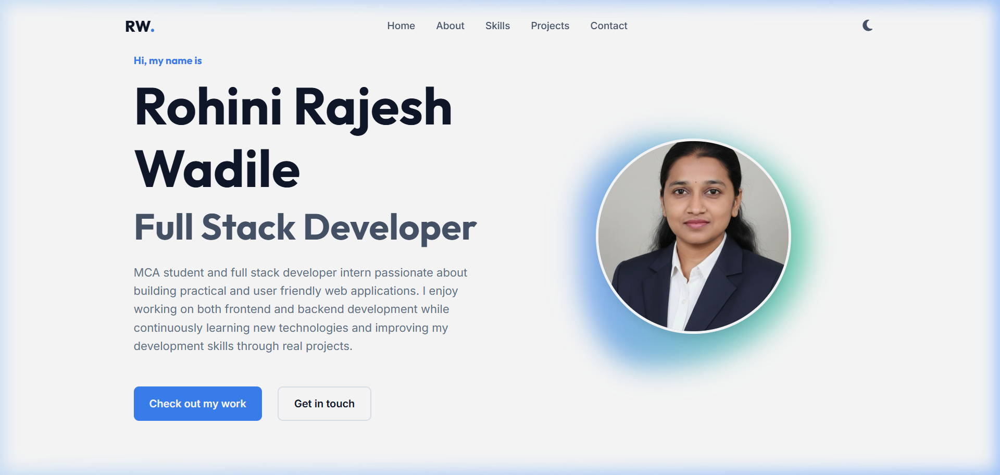

# Full-Stack Developer Portfolio



A modern, responsive, full-stack developer portfolio website.

## Features
- **Frontend**: Vanilla HTML5, CSS3, JavaScript. Component-based architecture.
- **Backend**: Node.js, Express.js REST API.
- **Database**: MongoDB with Mongoose.
- **Styling**: Custom CSS variables, Light/Dark mode, Responsive grid/flexbox layouts.
- **Dynamic Content**: Profile, Skills, Projects, and Socials are driven by the backend.
- **Contact Form**: Validation and secure submission via API.

## Project Structure
- `/frontend`: Static files (HTML, CSS, JS, Assets).
- `/backend`: Express API server, Mongoose models, routes, and controllers.

## Local Setup

1. **Install dependencies**:
   ```bash
   npm install
   ```

2. **Environment Variables**:
   Create a `.env` file in the `backend` folder based on `backend/.env.example`. Make sure MongoDB is running locally or provide an Atlas URI.

3. **Seed Database**:
   Populate the database with initial sample data.
   ```bash
   npm run seed
   ```

4. **Run Application**:
   Start both backend and frontend concurrently for development.
   ```bash
   npm run dev
   ```
   The API runs on `http://localhost:5000` and the frontend runs on `http://localhost:3000`.

## Deployment

### Frontend (Vercel/Netlify)
1. Set the root directory to `/frontend`.
2. No build command needed.
3. Update `API_BASE_URL` in `frontend/js/api.js` to point to your live backend URL.

### Backend (Render/Railway)
1. Set the root directory to `/backend` (or run `node backend/src/server.js` from root).
2. Ensure you add your production `.env` variables (MongoDB URI, SMTP, etc.).
3. The server will also serve the static frontend if `NODE_ENV=production`.

## Technologies Used
- Node.js & Express
- MongoDB & Mongoose
- HTML5 & CSS3
- Vanilla JavaScript
